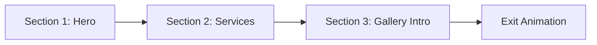

# Crown Nail & Beauty NZ - Award-Winning Website

> An Awwwards-worthy website featuring a scroll-driven 3D hand centerpiece, Sanity CMS, and "Sophisticated Sanctuary" aesthetics.

---

## Decisions Made

| Topic | Decision |
|-------|----------|
| CMS | **Sanity** for structured content |
| Booking | **Visual mockup** (no backend integration) |
| 3D Hand | **Centerpiece for 3 sections** with scroll rotation + clean exit |
| Polish Model | Decorative accents in hero + services section |

---

## 3D Hand Model Journey (Core Experience)

The hand model is the visual centerpiece, persisting across three sections before elegantly exiting:



### Section 1: Hero (0-100vh scroll)
| Property | Value |
|----------|-------|
| Position | Right side, 60% viewport width |
| Rotation | Slight tilt, palm facing user |
| Animation | Gentle floating idle + mouse parallax |
| Lighting | Warm studio, gold rim light on nails |

### Section 2: Services (100vh-200vh)
| Property | Value |
|----------|-------|
| Position | Transitions to center-left |
| Rotation | Rotates 45° to show nail detail |
| Animation | Scroll-linked rotation (GSAP ScrollTrigger) |
| Interaction | Nails "glow" when hovering service cards |

### Section 3: Gallery Intro (200vh-300vh)
| Property | Value |
|----------|-------|
| Position | Slides to far left, partially off-screen |
| Rotation | 90° showing profile view |
| Scale | Reduces to 60% |
| Purpose | Transition focus to portfolio photos |

### Exit Animation (300vh+)
| Effect | Description |
|--------|-------------|
| Motion | Graceful drift upward + fade out |
| Duration | 0.8s ease-out |
| Trigger | User scrolls past gallery threshold |

---

## Polish Model Usage

| Location | Implementation |
|----------|----------------|
| Hero Background | 3-4 floating polish bottles with slow rotation, positioned in background layer |
| Services Section | Single polish bottle beside "Nail Services" card, interactive hover tilt |
| Booking Section | Decorative element next to technician cards |

---

## Design System (Crown Brand Identity)

### Color Palette (Aligned to Brand)


| Role | Color | Hex | Usage |
|------|-------|-----|-------|
| Primary Base | Marble Stone | `#E8E4E0` | Main backgrounds (textured) |
| Secondary Base | Clean White | `#FAFAFA` | Cards, overlays |
| Primary Text | Crown Black | `#1A1A1A` | Headlines, logo, key text |
| Secondary Text | Charcoal Grey | `#4A4A4A` | Body copy, descriptions |
| Subtle Text | Stone Grey | `#8A8A8A` | Metadata, hints |
| Accent Primary | Warm Black | `#2C2C2C` | CTAs, buttons, active states |
| Accent Secondary | Soft Rose | `#D4B5B0` | Feminine touches, highlights |
| Luxury Hint | Brushed Gold | `#C9A962` | Subtle accents only (sparingly) |

> [!NOTE]
> The brand uses a **monochromatic** palette with black/charcoal on marble-grey. Gold is reserved for subtle luxury hints, not primary accents.

### Typography Scale

| Element | Font | Weight | Size (Desktop) | Size (Mobile) | Letter-Spacing |
|---------|------|--------|----------------|---------------|----------------|
| H1 Hero | Cormorant Garamond | 300 | 120px | 56px | -0.02em |
| H2 Section | Cormorant Garamond | 400 | 64px | 40px | -0.01em |
| H3 Card | Cormorant Garamond | 500 | 32px | 24px | 0 |
| Body | Satoshi | 400 | 18px | 16px | +0.01em |
| Body Small | Satoshi | 400 | 14px | 13px | +0.02em |
| Button | Satoshi | 500 | 14px | 14px | +0.08em |
| Nav Links | Satoshi | 500 | 14px | 16px | +0.05em |

### Color Usage Map (Section by Section)

| Section | Background | Text | Accent |
|---------|------------|------|--------|
| NavBar | Transparent → `#E8E4E0` 90% | `#1A1A1A` | Underline slide-in |
| Hero | `#E8E4E0` marble texture | `#1A1A1A` | `#2C2C2C` CTA button |
| Services | `#FAFAFA` clean | `#1A1A1A` | `#D4B5B0` card hover |
| Gallery | `#1A1A1A` (dark) | `#FAFAFA` | Subtle gold highlights |
| About | `#E8E4E0` textured | `#1A1A1A` | `#D4B5B0` accents |
| Booking | `#FAFAFA` | `#1A1A1A` | `#2C2C2C` buttons |
| Footer | `#1A1A1A` | `#FAFAFA` | `#8A8A8A` links |

### Animation Timing

| Animation Type | Duration | Easing | Delay Pattern |
|----------------|----------|--------|---------------|
| Page transitions | 600ms | cubic-bezier(0.22, 1, 0.36, 1) | - |
| Card reveals | 500ms | ease-out | stagger 100ms |
| Hover states | 300ms | ease-out | - |
| 3D rotations | 800ms | cubic-bezier(0.33, 1, 0.68, 1) | - |
| Scroll triggers | Scrub-linked | linear | - |
| Text reveals | 400ms | ease-out | stagger 50ms per letter |

---

## Section-by-Section Layout

### 1. NavBar (Fixed)

```
┌────────────────────────────────────────────────────────────┐
│ [Crown Logo]          Services  Gallery  About  [Book Now] │
└────────────────────────────────────────────────────────────┘
```

| Feature | Detail |
|---------|--------|
| Background | Glassmorphism (blur 20px, `#E8E4E0` 90%) on scroll |
| Logo | Black crown icon + "CROWN" text, subtle scale on hover |
| Links | Magnetic hover with black underline slide-in |
| CTA | Black button with soft hover glow |

---

### 2. Hero Section

```
┌──────────────────────────────────────────────────────────────────┐
│                                                    ┌──────────┐  │
│  Where Meticulous                                  │          │  │
│  Craftsmanship Meets                               │  3D HAND │  │
│  Serene Luxury                                     │          │  │
│                                                    └──────────┘  │
│  [Reserve Your Experience]     [View Portfolio]                  │
│                                                                  │
│  [Floating polish bottles in background - subtle parallax]       │
└──────────────────────────────────────────────────────────────────┘
```

| Element | Animation |
|---------|-----------|
| Headline | Split text reveal, word-by-word fade-in |
| Subtext | Fade up 0.3s after headline |
| CTA buttons | Scale in with magnetic hover |
| Background | Subtle grain texture + floating particles |
| Hand model | Entrance: float up from below + fade in |

---

### 3. Services Section (Bento Grid)

```
┌──────────────────────────────────────────────────────────────┐
│ Our Artistry                                                 │
├─────────────────────┬─────────────────┬─────────────────────┤
│                     │                 │                     │
│   NAIL ARTISTRY     │  LASH STUDIO    │    WAX & TINT       │
│   [Large Card]      │  [Medium]       │    [Medium]         │
│                     │                 │                     │
│   3D Hand here      │                 │                     │
│                     ├─────────────────┼─────────────────────┤
│                     │   FACE CARE     │  PERMANENT MAKEUP   │
│                     │   [Small]       │  [Small]            │
└─────────────────────┴─────────────────┴─────────────────────┘
```

| Card Feature | Design |
|--------------|--------|
| Background | `#FAFAFA` clean white |
| Border | 1px `#E0E0E0` with subtle shadow on hover |
| Icon | Black line-art, animated stroke-draw on scroll |
| Pricing hint | "From $XX" in `#8A8A8A` |
| Hover | Card lifts 8px, soft rose (`#D4B5B0`) border accent |

---

### 4. Portfolio Gallery (Dark Section)

```
┌──────────────────────────────────────────────────────────────┐
│ ← DRAG TO EXPLORE                                            │
│                                                              │
│  ┌────────┐ ┌────────┐ ┌────────┐ ┌────────┐ ┌────────┐     │
│  │        │ │        │ │        │ │        │ │        │     │
│  │ Photo  │ │ Photo  │ │ Photo  │ │ Photo  │ │ Photo  │ →   │
│  │        │ │        │ │        │ │        │ │        │     │
│  └────────┘ └────────┘ └────────┘ └────────┘ └────────┘     │
│                                                              │
│  [View Full Gallery]                                         │
└──────────────────────────────────────────────────────────────┘
```

| Feature | Implementation |
|---------|----------------|
| Scroll type | Horizontal drag (Framer Motion) |
| Image hover | Scale 1.05 + cursor "View" |
| Lightbox | Full-screen with zoom + gesture close |
| Background | `#1A1A1A` with subtle floating particles |
| Transition in | Cards stagger from right |

---

### 5. About Section

```
┌──────────────────────────────────────────────────────────────┐
│                                                              │
│  ┌──────────────┐                                            │
│  │              │   THE CROWN PHILOSOPHY                     │
│  │   Artisan    │                                            │
│  │   Photo      │   Every stroke, every detail, every        │
│  │   (Parallax) │   moment is crafted with intention.        │
│  │              │                                            │
│  └──────────────┘   [Meet Our Team]                          │
│                                                              │
└──────────────────────────────────────────────────────────────┘
```

| Element | Effect |
|---------|--------|
| Image | Parallax scroll (0.5 speed) |
| Text | Reveal on scroll with text-mask effect |
| Certifications | Badge icons fade in sequentially |

---

### 6. Booking Section (Visual Mockup)

```
┌──────────────────────────────────────────────────────────────┐
│ Reserve Your Personalized Experience                          │
├─────────────────────────────┬────────────────────────────────┤
│                             │  SELECT YOUR ARTISAN           │
│   ┌─────────────────────┐   │  ┌──────┐ ┌──────┐ ┌──────┐   │
│   │     CALENDAR        │   │  │Sarah │ │ Amy  │ │ Jade │   │
│   │   (Visual only)     │   │  │ Nail │ │ Lash │ │ Nail │   │
│   │                     │   │  │ Art  │ │ Pro  │ │ Tech │   │
│   │   [Premium slots    │   │  └──────┘ └──────┘ └──────┘   │
│   │    highlighted]     │   │                                │
│   └─────────────────────┘   │  ☐ Private Suite (+$30)       │
│                             │  ☐ After-Hours Booking         │
│                             │                                │
│   [Continue to Confirm]     │  [Contact for VIP]             │
└─────────────────────────────┴────────────────────────────────┘
```

---

### 7. Testimonials

```
┌──────────────────────────────────────────────────────────────┐
│                                                              │
│     "Sarah's attention to the cuticle line was               │
│      extraordinary. Worth every dollar."                     │
│                                                              │
│              — Michelle T., Auckland                         │
│                                                              │
│          ○   ●   ○   ○   (carousel dots)                    │
└──────────────────────────────────────────────────────────────┘
```

| Feature | Design |
|---------|--------|
| Quote | Large Cormorant Garamond, italic |
| Animation | Crossfade between testimonials |
| Auto-play | 5s interval, pause on hover |

---

### 8. Contact/Footer

```
┌──────────────────────────────────────────────────────────────┐
│  CROWN                              CONTACT                  │
│  NAIL & BEAUTY                                               │
│                                     123 Queen Street         │
│  Where meticulous craftsmanship     Auckland, NZ             │
│  meets serene luxury                hello@crownnails.co.nz   │
│                                     +64 21 XXX XXXX          │
│  ─────────────────────────────────────────────────────────   │
│  © 2026 Crown Nail & Beauty NZ      IG  FB  TW               │
└──────────────────────────────────────────────────────────────┘
```

---

## Sanity CMS Schema

| Content Type | Fields |
|--------------|--------|
| `service` | title, description, priceFrom, image, category |
| `technician` | name, photo, specialty, bio, certifications |
| `testimonial` | quote, author, location, rating |
| `galleryImage` | image, category, featured |
| `siteSettings` | logo, contactEmail, phone, address, socialLinks |

---

## File Structure

```
crown-nail-beauty/
├── public/
│   ├── images/          # Portfolio photos, logos
│   ├── models/          # Hand-model.glb, Polish-model.glb
│   └── fonts/           # Satoshi local files
├── src/
│   ├── app/
│   │   ├── layout.tsx
│   │   ├── page.tsx
│   │   └── globals.css
│   ├── components/
│   │   ├── layout/      # NavBar, Footer, SmoothScroll
│   │   ├── sections/    # Hero, Services, Gallery, About, Booking, Testimonials
│   │   ├── three/       # HandScene, PolishScene, ScrollCamera
│   │   └── ui/          # MotionLink, GlassCard, Button, ImageLightbox
│   ├── lib/
│   │   ├── sanity/      # Client, queries
│   │   └── animations.ts
│   └── hooks/
│       ├── useScrollProgress.ts
│       └── useLenis.ts
├── sanity/
│   ├── schemas/
│   └── sanity.config.ts
└── tailwind.config.ts
```

---

## Verification Plan

### Build & Lint
```bash
npm run build
npm run lint
```

### Browser Testing
1. Start `npm run dev`
2. Verify 3D hand scroll journey across 3 sections
3. Test hand exit animation at gallery
4. Confirm all Framer Motion animations
5. Test mobile at 375px, 768px, 1024px

### Performance Targets
| Metric | Target |
|--------|--------|
| LCP | < 2.5s |
| CLS | 0 |
| INP | < 200ms |
| Lighthouse | 90+ all categories |
